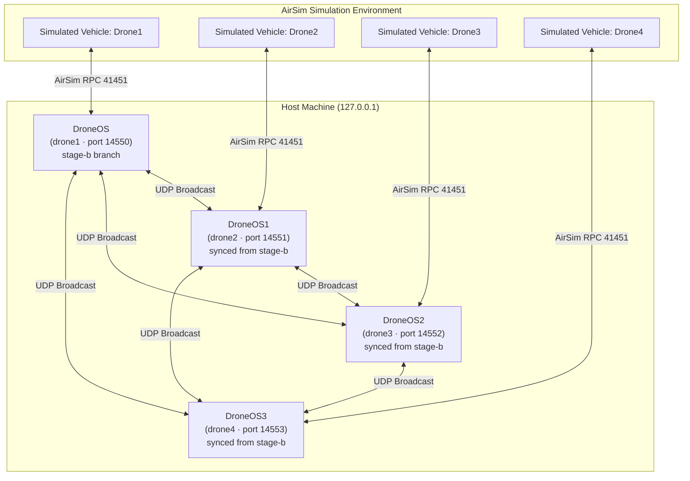
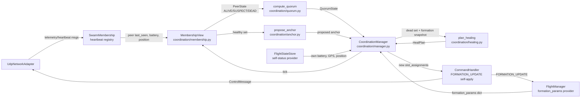
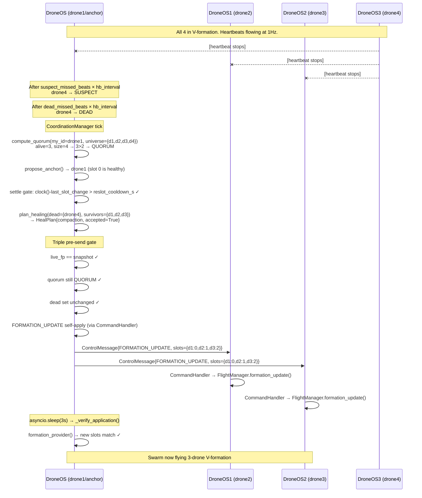

# Design Document: Self-Healing Formation Sync

## Overview

The self-healing formation sync feature enables a 4-drone swarm running DroneOS to automatically detect when one or more members have failed and recompute + broadcast a new formation assignment to the surviving drones — all without operator intervention. The heal logic already exists in `DroneOS/core/coordination/` on the `stage-b` branch, but three critical gaps prevent it from running end-to-end: (1) the coordination subtree has never been copied into the `DroneOS1/`, `DroneOS2/`, and `DroneOS3/` instances; (2) all imports inside the coordination modules hardcode the `DroneOS.` namespace, which is wrong for instances 1-3; and (3) there is no AirSim integration test that actually exercises the full detect → plan → send → apply cycle under simulation conditions.

This document captures the complete design for closing those gaps: the module sync strategy, the import fix, the per-instance config changes, the AirSim integration test harness, and a sync script to prevent future drift.

---

## Architecture

### Node Topology

All four instances form a flat peer-to-peer UDP mesh. There is no dedicated coordinator node — every running DroneOS node runs its own `CoordinationManager`, but only the elected anchor drone actually computes and broadcasts the `FORMATION_UPDATE` message when a failure is detected.



### Intra-Node Component Wiring

Each DroneOS instance has this internal wiring for the coordination path:



---

## Sequence Diagrams

### Happy-Path Heal: Drone4 Dies



### Rejoin Stabilization

```mermaid
sequenceDiagram
    participant D4 as DroneOS3 (drone4 - was DEAD)
    participant D1 as DroneOS (drone1/anchor)

    D4->>D1: DroneJoinMessage + heartbeat resumes
    Note over D1: MembershipView: drone4.rejoin_stable_start = now()

    loop Every hb_interval
        D4->>D1: heartbeat
        D1->>D1: missed_beats reset; still DEAD state
    end

    Note over D1: clock() - rejoin_stable_start >= rejoin_stable_s (10s)
    D1->>D1: drone4.state = ALIVE
    Note over D1: CoordinationManager sees no dead nodes; heal loop idles
```

---

## Components and Interfaces

### Component 1: CoordinationManager (`coordination/manager.py`)

**Purpose**: Central async loop that drives the entire heal lifecycle — membership ticking, quorum computation, anchor election, plan request, triple-gating, send, and verify.

**Interface**:
```python
class CoordinationManager:
    def __init__(
        self,
        swarm_manager: SwarmMembership,
        flight_cfg: Any,                        # FlightConfig with .coordination dict
        heartbeat_interval: float = 1.0,
        formation_provider: Callable[[], Optional[dict]] = None,
        self_status_provider: Callable[[], dict] = None,
        clock: Callable[[], float] = None,
        formation_update_sender: Callable[[dict, list[str]], Awaitable[bool]] = None,
    ) -> None: ...

    async def run(self) -> None:
        """Main poll loop. Returns immediately if coordination.enabled == False."""

    async def _handle_healing(
        self,
        now: float,
        q_state: QuorumState,
        fp: dict,
        healthy_members: set[str],
        dead_pid: str,
        prop_anchor: str,
        self_status: dict,
    ) -> None:
        """Per-dead-drone heal attempt. Plans, gates, and sends if safe."""

    async def _send_formation_update(
        self,
        memo_key: str,
        plan: HealPlan,
        fp: dict,
        prop_anchor: str,
        healthy_members: set[str],
        true_dead: set[str],
    ) -> None:
        """Executes the triple pre-send gate then calls formation_update_sender."""

    async def _verify_application(
        self,
        new_slots: dict,
        fp: dict,
    ) -> None:
        """3-second post-send check: confirms live formation matches new_slots."""
```

**Responsibilities**:
- Drive `MembershipView.evaluate_tick()` every poll cycle
- Extract peer state from `SwarmMembership.registry` into `MembershipView` via `update_from_peer()`
- Enforce the settle gate (`reslot_cooldown_s` elapsed since last observed slot change)
- Enforce the session heal cap (`max_heals_per_session`)
- Check for the kill-switch file (`COORD_DISABLE` by default)
- Memoize completed plans so the same dead-set is not replanned repeatedly

---

### Component 2: MembershipView (`coordination/membership.py`)

**Purpose**: Tracks the heartbeat-derived liveness state (`ALIVE` / `SUSPECT` / `DEAD`) of every peer drone independent of the swarm heartbeat registry. Handles rejoin stabilization.

**Interface**:
```python
class MembershipView:
    def update_from_peer(
        self,
        peer_id: str,
        last_seen: float,
        battery: Optional[float],
        lat: Optional[float],
        lon: Optional[float],
        alt: Optional[float],
        peer_position_stamp: Optional[float] = None,
    ) -> None:
        """Called every tick from CoordinationManager with data from SwarmMembership."""

    def evaluate_tick(self, hb_interval: float = 1.0) -> None:
        """Advances ALIVE→SUSPECT→DEAD state machine based on missed beat count."""

    def get_alive_peers(self) -> list[str]: ...
```

**State Machine**:
```
ALIVE ──(missed >= suspect_missed_beats)──► SUSPECT
SUSPECT ──(missed >= dead_missed_beats)──► DEAD
DEAD ──(heartbeats resume, stable for rejoin_stable_s)──► ALIVE
```

---

### Component 3: HealPlanner (`coordination/healing.py`)

**Purpose**: Pure function module that, given the current survivors' positions and formation parameters, computes the optimal `HealPlan` using three strategies and evaluates each for path safety.

**Interface**:
```python
def plan_healing(
    healthy_members: list[str],
    dead_members: list[str],
    formation_params: dict,              # {type, spacing, slot_assignments, members}
    positions: dict[str, tuple[float, float]],   # drone_id → (north_m, east_m) in anchor frame
    dead_positions: dict[str, tuple[float, float]],
    flight_cfg: Any,
    is_anchor_dead: bool = False,
    advisory: bool = False,
) -> HealPlan: ...

def validate_formation_params(params: dict, flight_cfg: Any) -> bool:
    """Returns True iff params has valid type/spacing that meets min-sep constraints."""
```

**Three Heal Strategies** (tried in order; lowest `total_travel` accepted plan wins):
1. **compaction** — shift all survivors left to fill the hole
2. **tail_fill** — move only the highest-slot survivor into the dead slot
3. **anchor_promotion** — when slot-0 is dead, elect new anchor and renumber

---

### Component 4: Quorum (`coordination/quorum.py`)

**Purpose**: Determines if the local node can safely act as anchor. Returns `QUORUM` (>50% of formation universe alive), `ISOLATED` (≤50%), or `IDLE` (not in any formation).

**Interface**:
```python
def compute_quorum(
    my_id: str,
    slot_assignments: dict,
    membership_view: MembershipView,
    quorum_required: bool,
) -> QuorumState: ...
```

---

### Component 5: AnchorElector (`coordination/anchor.py`)

**Purpose**: Stateless function that nominates which healthy drone should compute and send the heal. The current slot-0 drone stays anchor if healthy; otherwise the lexicographically-first healthy drone is nominated after a dwell timer.

**Interface**:
```python
def propose_anchor(
    slot_assignments: dict,
    healthy_members: set[str],
    current_proposed: Optional[str],
    current_proposed_time: Optional[float],
    anchor_min_dwell_s: float,
    now: float,
) -> tuple[Optional[str], Optional[float]]: ...

def is_healthy(
    peer_id: str,
    my_id: str,
    membership_view: MembershipView,
    swarm: SwarmMembership,
    anchor_min_battery: float,
    now: float,
    max_position_age: float = 5.0,
) -> bool: ...
```

---

### Component 6: FormationUpdateSender (`main.py` closure)

**Purpose**: Bridges the coordination layer to the network/command layer. Self-applies the new formation params via `CommandHandler` first, then unicasts the `FORMATION_UPDATE` `ControlMessage` to each remote target.

**Interface**:
```python
def create_formation_update_sender(
    node_id: str,
    command_handler: CommandHandler,
    network: UdpNetworkAdapter,
) -> Callable[[dict, list[str]], Awaitable[bool]]:
    async def formation_update_sender(params: dict, targets: list[str]) -> bool:
        """Returns True iff self-apply and all remote sends succeed without exception."""
    return formation_update_sender
```

---

### Component 7: SyncScript (`scripts/sync_coordination.ps1` / `.sh`)

**Purpose**: Propagates the `DroneOS/core/coordination/` subtree and the coordination-related sections of `main.py` and `shared/config/models.py` into `DroneOS1/`, `DroneOS2/`, `DroneOS3/` and performs the namespace substitution.

**Interface**:
```
scripts/sync_coordination.ps1 [-DryRun] [-Source DroneOS] [-Targets DroneOS1,DroneOS2,DroneOS3]
```

---

## Data Models

### HealPlan

```python
class HealPlan:
    slot_assignments: dict[str, int]   # drone_id → new slot index
    reason: str                        # "compaction" | "tail_fill" | "anchor_promotion" | "NO_PLAN"
    moves: dict[str, tuple[int, int]]  # drone_id → (old_slot, new_slot)
    total_travel: float                # sum of per-drone Euclidean move distances (m)
    min_separation: float              # minimum pairwise separation over all move paths (m)
    accepted: bool
    reject_reason: str
    reject_kind: RejectKind            # FINAL | TRANSIENT | CONFIG
    is_hold: bool                      # True when plan is a no-op (safe to hold current slots)
    hold_slot: int                     # slot index of the dead drone being held
    unsettled: Optional[dict]          # settle-gate diagnostic info
```

**Validation Rules**:
- `slot_assignments` must form a contiguous zero-based integer range covering all healthy survivors
- `slot_assignments[proposed_anchor] == 0`
- No drone in `slot_assignments` appears in the dead set
- `total_travel >= 0.0`
- `min_separation >= flight_cfg.formation.min_formation_separation_m`

---

### Formation Params dict

The canonical format passed between `FlightManager`, `CoordinationManager`, and `formation_update_sender`:

```python
{
    "type": str,                         # FormationType value e.g. "V"
    "spacing": float,                    # meters between formation slots
    "slot_assignments": dict[str, int],  # drone_id → slot index
    "members": list[str],                # sorted list of non-anchor member IDs
    "speed": float,                      # optional formation flight speed m/s
}
```

---

### Coordination Config (in `FlightConfig.coordination: dict`)

```yaml
coordination:
  enabled: bool           # master switch (default: false)
  mode: str               # "advisory" | "active"
  armed: bool             # must be true for active sends
  suspect_missed_beats: int     # 3 prod / 2 test
  dead_missed_beats: int        # 6 prod / 4 test
  rejoin_stable_s: float        # 10.0 prod / 5.0 test
  anchor_min_battery: float     # 30 %
  anchor_min_dwell_s: float     # 10.0 s
  heal_max_position_age_s: float # 5.0 s
  quorum_required: bool          # true
  reslot_cooldown_s: float       # 15.0 prod / 5.0 test
  armed: bool
  kill_switch_file: str          # "COORD_DISABLE"
  resend_count: int              # 2
  max_heals_per_session: int     # 3
```

---

## Algorithmic Pseudocode

### CoordinationManager Main Poll Loop

```pascal
ALGORITHM CoordinationManager.run()
INPUT: self (initialized CoordinationManager)
OUTPUT: None (runs until self.is_running = false)

PRECONDITIONS:
  - self.enabled = true
  - self.formation_provider is set
  - self.swarm is set

POSTCONDITIONS:
  - For each discovered DEAD peer, at most one FORMATION_UPDATE is sent per dead set
  - self._heal_count <= self.max_heals_per_session at all times

BEGIN
  IF NOT self.enabled THEN
    RETURN
  END IF

  self.is_running ← true
  poll_interval ← clamp(hb_interval / 2.0, 0.25, 0.5)

  WHILE self.is_running DO
    now ← self.clock()
    
    // Kill-switch check
    IF file_exists(self.kill_switch_file) THEN
      CONTINUE  // skip this tick
    END IF
    
    // Session cap
    IF self._heals_disabled THEN
      CONTINUE
    END IF
    
    // --- Update MembershipView from SwarmRegistry ---
    FOR each peer IN swarm.registry.get_all_peers() DO
      membership.update_from_peer(
        peer.drone_id, peer.last_seen, peer.battery_level,
        peer.lat, peer.lon, peer.alt, peer.last_position_time
      )
    END FOR
    membership.evaluate_tick(hb_interval)
    
    // --- Settle gate: detect slot changes ---
    fp ← formation_provider()
    IF fp IS NULL THEN
      CONTINUE
    END IF
    current_slots ← fp["slot_assignments"]
    IF current_slots != self._last_slot_assignments THEN
      self._last_slot_change_time ← now
      self._last_slot_assignments ← copy(current_slots)
    END IF
    
    // --- Quorum ---
    q_state ← compute_quorum(my_id, current_slots, membership, quorum_required)
    IF q_state != QUORUM THEN
      CONTINUE
    END IF
    
    // --- Per-dead-drone heal attempt ---
    true_dead ← {pid : pid IN current_slots AND membership.nodes[pid].state = DEAD}
    IF true_dead IS EMPTY THEN
      CONTINUE
    END IF
    
    healthy ← {pid : pid IN current_slots AND pid NOT IN true_dead
                    AND (pid = my_id OR membership.nodes[pid].state = ALIVE)}
    prop_anchor, prop_time ← propose_anchor(current_slots, healthy, last_proposed_anchor, ...)
    
    IF prop_anchor != my_id THEN
      CONTINUE  // not our turn to heal
    END IF
    
    FOR each dead_pid IN true_dead DO
      AWAIT _handle_healing(now, q_state, fp, healthy, dead_pid, prop_anchor, self_status)
    END FOR
    
    AWAIT sleep(poll_interval)
  END WHILE
END
```

**Loop Invariant**: On every iteration, `self._heal_count <= self.max_heals_per_session`. The memo dict ensures any accepted or final-rejected plan for a given `(dead_pid, dead_slot)` key is not replanned.

---

### HealPlan Path Safety Evaluator

```pascal
ALGORITHM _evaluate_plan(new_assignments, start_positions, dead_positions,
                          f_type, spacing, min_required_sep, ...)
INPUT:
  - new_assignments: dict[str, int]  -- candidate slot map for survivors
  - start_positions: dict[str, (float, float)]  -- current NED positions in anchor frame
  - dead_positions: dict[str, (float, float)]   -- last known positions of dead drones
OUTPUT: EvaluatedPlan{accepted, min_separation, total_travel, reject_reason}

PRECONDITIONS:
  - All positions are in the old anchor's coordinate frame
  - proposed_anchor has slot 0 in new_assignments

BEGIN
  anchor_start ← start_positions[proposed_anchor]
  // Compute new target positions by applying formation geometry from anchor_start
  FOR each (pid, new_slot) IN new_assignments DO
    offset ← _get_slot_offset(f_type, new_slot, spacing, len(new_assignments))
    target_positions[pid] ← anchor_start + offset
  END FOR

  // Check minimum pairwise separation along move paths (including dead-drone obstacles)
  min_sep ← +∞
  total_travel ← 0.0
  
  FOR each pid IN new_assignments DO
    path_seg ← (start_positions[pid], target_positions[pid])
    travel ← euclidean(start_positions[pid], target_positions[pid])
    total_travel ← total_travel + travel
    
    FOR each other_pid IN new_assignments WHERE other_pid != pid DO
      other_path ← (start_positions[other_pid], target_positions[other_pid])
      sep ← _segment_distance(path_seg, other_path)
      min_sep ← min(min_sep, sep)
    END FOR
    
    IF dead_drone_obstacle THEN
      FOR each dead_pid IN dead_positions DO
        obstacle_dist ← _point_to_segment(dead_positions[dead_pid], path_seg[0], path_seg[1])
        IF obstacle_dist < dead_obstacle_radius_m THEN
          RETURN EvaluatedPlan{accepted=false, reject_kind=TRANSIENT, 
                               reject_reason="path crosses dead drone obstacle"}
        END IF
      END FOR
    END IF
  END FOR
  
  IF min_sep < min_required_sep THEN
    RETURN EvaluatedPlan{accepted=false, reject_kind=FINAL,
                         reject_reason="min separation violated"}
  END IF
  
  RETURN EvaluatedPlan{accepted=true, min_separation=min_sep, total_travel=total_travel}
END
```

**Postconditions**:
- If `accepted = true`, all pairwise path separations ≥ `min_required_sep`
- If `accepted = true`, no move path intersects any dead-drone obstacle radius
- `total_travel ≥ 0.0`

---

### Module Sync Algorithm

```pascal
ALGORITHM sync_coordination_module(source_ns, target_ns, source_dir, target_dir)
INPUT:
  - source_ns: "DroneOS"
  - target_ns: "DroneOS1" | "DroneOS2" | "DroneOS3"
  - source_dir: path to source instance root
  - target_dir: path to target instance root

BEGIN
  // Step 1: Copy coordination subtree
  src_coord ← source_dir / "core" / "coordination"
  dst_coord ← target_dir / "core" / "coordination"
  
  FOR each .py file IN src_coord DO
    content ← read_file(file)
    content ← replace_all(content, "from DroneOS.", "from {target_ns}.")
    content ← replace_all(content, "import DroneOS.", "import {target_ns}.")
    write_file(dst_coord / file.name, content)
  END FOR
  
  // Step 2: Sync FlightConfig.coordination field in shared/config/models.py
  src_models ← source_dir / "shared" / "config" / "models.py"
  dst_models ← target_dir / "shared" / "config" / "models.py"
  sync_coordination_dict_field(src_models, dst_models, source_ns, target_ns)
  
  // Step 3: Sync coordination wiring block in main.py
  src_main ← source_dir / "main.py"
  dst_main ← target_dir / "main.py"
  sync_main_coordination_block(src_main, dst_main, source_ns, target_ns)
  
  // Step 4: Copy test configs
  src_test_cfg ← source_dir / "configs" / "flight.test.yaml"
  dst_test_cfg ← target_dir / "configs" / "flight.test.yaml"
  copy_file(src_test_cfg, dst_test_cfg)
  
  ASSERT all imports in dst_coord reference target_ns (not source_ns)
  ASSERT dst_models contains "coordination: Optional[Dict[str, Any]] = None"
END
```

---

### AirSim Integration Test Sequence

```pascal
ALGORITHM test_heal_on_drone4_failure()
INPUT: running AirSim environment, 4 DroneOS processes
OUTPUT: pytest PASS / FAIL

PRECONDITIONS:
  - AirSim running with 4 vehicles named Drone1..Drone4
  - All 4 DroneOS instances running with coordination.enabled=true, mode=active, armed=true
  - reslot_cooldown_s=5, dead_missed_beats=4, suspect_missed_beats=2

BEGIN
  // Setup
  client ← airsim.MultirotorClient()
  client.confirmConnection()
  
  FOR each vehicle IN [Drone1, Drone2, Drone3, Drone4] DO
    client.enableApiControl(True, vehicle)
    client.armDisarm(True, vehicle)
    client.takeoffAsync(vehicle_name=vehicle).join()
  END FOR
  
  // Command V-formation via DroneOS command channel
  send_formation_command(type="V", spacing=15.0, 
                         slots={drone1:0, drone2:1, drone3:2, drone4:3})
  
  // Wait for formation convergence
  WAIT_UNTIL formation_converged(client, tolerance_m=3.0) OR timeout(30s)
  ASSERT formation_converged(client, tolerance_m=3.0),
         "Pre-heal formation not achieved within 30s"
  
  // Record pre-heal positions
  pre_positions ← {v: client.getMultirotorState(v).kinematics_estimated.position
                   FOR v IN [Drone1, Drone2, Drone3]}
  
  // Kill Drone4
  client.armDisarm(False, "Drone4")       // AirSim: cuts motors
  stop_process(drone4_process)            // OS: terminate DroneOS3
  
  // Wait for heal
  expected_heal_timeout_s ← dead_missed_beats × hb_interval + reslot_cooldown_s + 5s
  // = 4 × 1 + 5 + 5 = 14s; use 20s for headroom
  WAIT_UNTIL formation_healed(client, expected_slots={drone1:0, drone2:1, drone3:2},
                               tolerance_m=4.0) OR timeout(20s)
  
  // Assertions
  ASSERT formation_healed(client, {drone1:0, drone2:1, drone3:2}, tolerance_m=4.0),
         "Remaining 3 drones did not reformat within 20s"
  
  // Verify Drone1 (anchor) position unchanged (anchor never moves in compaction)
  post_d1 ← client.getMultirotorState("Drone1").kinematics_estimated.position
  ASSERT distance(pre_positions[Drone1], post_d1) < 2.0,
         "Anchor moved unexpectedly during heal"
  
  // Verify minimum separation
  post_positions ← {v: get_position(client, v) FOR v IN [Drone1, Drone2, Drone3]}
  FOR each pair (a, b) IN combinations(post_positions.values(), 2) DO
    ASSERT euclidean(a, b) >= min_formation_separation_m,
           f"Separation violated after heal: {euclidean(a,b):.1f}m"
  END FOR
  
  // Cleanup
  FOR each vehicle IN [Drone1, Drone2, Drone3] DO
    client.landAsync(vehicle_name=vehicle).join()
    client.armDisarm(False, vehicle)
  END FOR
END
```

---

## Key Functions with Formal Specifications

### `plan_healing()`

```python
def plan_healing(
    healthy_members: list[str],
    dead_members: list[str],
    formation_params: dict,
    positions: dict[str, tuple[float, float]],
    dead_positions: dict[str, tuple[float, float]],
    flight_cfg: Any,
    is_anchor_dead: bool = False,
    advisory: bool = False,
) -> HealPlan
```

**Preconditions**:
- `len(healthy_members) >= 1`
- `len(dead_members) >= 1`
- `set(healthy_members) | set(dead_members) == set(formation_params["slot_assignments"].keys())`
- `positions` contains an entry for every `pid` in `healthy_members`
- `formation_params["spacing"] >= 1.5 * max(min_sep, min_ca)` (validated by `validate_formation_params`)

**Postconditions**:
- If `result.accepted == True`:
  - `set(result.slot_assignments.keys()) == set(healthy_members)`
  - `result.slot_assignments` is a bijection onto `{0, 1, ..., len(healthy_members)-1}`
  - `result.slot_assignments[proposed_anchor] == 0`
  - `result.min_separation >= flight_cfg.formation.min_formation_separation_m`
- If `result.is_hold == True`: `result.accepted == True` and all moves are no-ops
- If `result.accepted == False` and `result.reject_kind == TRANSIENT`: the caller must retry on the next tick

---

### `compute_quorum()`

```python
def compute_quorum(
    my_id: str,
    slot_assignments: dict,
    membership_view: MembershipView,
    quorum_required: bool,
) -> QuorumState
```

**Preconditions**:
- `my_id` is defined
- `slot_assignments` is the live formation dict (may be empty)

**Postconditions**:
- If `my_id NOT IN slot_assignments`: returns `IDLE`
- If `quorum_required == False`: returns `QUORUM`
- If `alive_count > len(slot_assignments) / 2`: returns `QUORUM`; else `ISOLATED`
- Own node always counts as alive

---

### `formation_update_sender()`

```python
async def formation_update_sender(params: dict, targets: list[str]) -> bool
```

**Preconditions**:
- `"type"`, `"spacing"`, `"slot_assignments"` all present in `params`
- `targets` does not contain `node_id` (self) or any dead drone ID

**Postconditions**:
- `True` iff self-apply via `CommandHandler.handle_command()` succeeds AND all `network.broadcast_message()` calls complete without exception
- On any exception, returns `False` without rethrowing
- Self-application is always attempted first; if it fails, remote sends are skipped

---

## Correctness Properties

The following properties are expressed in property-based testing style (compatible with `hypothesis`). Each property must hold for **all** valid inputs within the stated domain.

### Property 1: Quorum Invariant

Healing may only fire when the alive drone count strictly exceeds half the formation universe size.

```python
@given(
    slot_assignments=formation_slot_dicts(),
    alive_ids=st.frozensets(st.text()),
)
def prop_quorum_invariant(slot_assignments, alive_ids):
    """
    For any slot_assignments dict and any alive_ids set,
    compute_quorum() MUST return QUORUM if and only if
    the number of alive members in the universe exceeds 50%.
    """
    universe = set(slot_assignments.keys())
    alive_in_universe = alive_ids & universe

    result = compute_quorum_from_sets(universe, alive_in_universe, quorum_required=True)

    if len(alive_in_universe) > len(universe) / 2:
        assert result == QuorumState.QUORUM
    else:
        assert result != QuorumState.QUORUM
```

**Invariant**: `alive_count > len(universe) / 2 ⟺ QuorumState.QUORUM`

**Validates: Requirements 6.1, 6.2, 6.3, 6.4, 6.5**

---

### Property 2: Slot Bijection

For any accepted `HealPlan`, the `slot_assignments` must be a bijection (one-to-one and onto) over the range `{0, 1, ..., len(survivors) - 1}`.

```python
@given(
    healthy=st.lists(st.text(min_size=1), min_size=1, max_size=8, unique=True),
    dead=st.lists(st.text(min_size=1), min_size=1, max_size=3, unique=True),
    formation_params=valid_formation_params(),
)
def prop_slot_bijection(healthy, dead, formation_params):
    """
    If plan_healing() returns an accepted plan, then slot_assignments
    must be a bijection from survivor IDs onto {0, ..., len(healthy)-1}.
    """
    assume(set(healthy).isdisjoint(set(dead)))

    plan = plan_healing(
        healthy_members=healthy,
        dead_members=dead,
        formation_params=formation_params,
        positions={h: (float(i), 0.0) for i, h in enumerate(healthy)},
        dead_positions={d: (float(i + 100), 0.0) for i, d in enumerate(dead)},
        flight_cfg=default_flight_cfg(),
    )

    if plan.accepted:
        n = len(healthy)
        # Keys are exactly the survivor set
        assert set(plan.slot_assignments.keys()) == set(healthy)
        # Values are exactly {0, 1, ..., n-1}
        assert set(plan.slot_assignments.values()) == set(range(n))
        # No duplicates (bijection)
        assert len(plan.slot_assignments.values()) == len(set(plan.slot_assignments.values()))
```

**Invariant**: `plan.accepted ⟹ set(plan.slot_assignments.values()) == {0, …, n−1}` where `n = len(survivors)`

**Validates: Requirements 7.1, 7.2, 7.3, 7.4**

---

### Property 3: Anchor Invariant

The proposed anchor always receives slot 0 in any accepted `HealPlan`.

```python
@given(
    healthy=st.lists(st.text(min_size=1), min_size=1, max_size=8, unique=True),
    dead=st.lists(st.text(min_size=1), min_size=1, max_size=3, unique=True),
    formation_params=valid_formation_params(),
)
def prop_anchor_gets_slot_zero(healthy, dead, formation_params):
    """
    For any accepted HealPlan, the drone elected as proposed_anchor
    must always hold slot index 0.
    """
    assume(set(healthy).isdisjoint(set(dead)))

    plan = plan_healing(
        healthy_members=healthy,
        dead_members=dead,
        formation_params=formation_params,
        positions={h: (float(i), 0.0) for i, h in enumerate(healthy)},
        dead_positions={d: (float(i + 100), 0.0) for i, d in enumerate(dead)},
        flight_cfg=default_flight_cfg(),
    )

    if plan.accepted:
        # Determine proposed anchor: current slot-0 if healthy, else lex-first healthy drone
        current_anchor = min(
            (k for k, v in formation_params["slot_assignments"].items() if v == 0),
            default=None,
        )
        if current_anchor in healthy:
            proposed_anchor = current_anchor
        else:
            proposed_anchor = min(healthy)  # lex-first

        assert plan.slot_assignments[proposed_anchor] == 0, (
            f"Anchor {proposed_anchor!r} got slot "
            f"{plan.slot_assignments[proposed_anchor]}, expected 0"
        )
```

**Invariant**: `plan.accepted ⟹ plan.slot_assignments[proposed_anchor] == 0`

**Validates: Requirements 8.1, 8.2, 8.3**

---

### Property 4: Separation Invariant

For any accepted `HealPlan`, the minimum pairwise separation between all drone move paths must be at least `min_formation_separation_m` from the flight config.

```python
@given(
    healthy=st.lists(st.text(min_size=2, max_size=1), min_size=2, max_size=8, unique=True),
    dead=st.lists(st.text(min_size=1), min_size=1, max_size=3, unique=True),
    formation_params=valid_formation_params(),
    flight_cfg=valid_flight_cfgs(),
)
def prop_separation_invariant(healthy, dead, formation_params, flight_cfg):
    """
    If plan_healing() returns an accepted plan, the recorded min_separation
    must be >= flight_cfg.formation.min_formation_separation_m.
    """
    assume(set(healthy).isdisjoint(set(dead)))
    assume(len(healthy) >= 2)

    plan = plan_healing(
        healthy_members=healthy,
        dead_members=dead,
        formation_params=formation_params,
        positions={h: (float(i * 20), 0.0) for i, h in enumerate(healthy)},
        dead_positions={d: (float(i + 200), 0.0) for i, d in enumerate(dead)},
        flight_cfg=flight_cfg,
    )

    if plan.accepted:
        min_sep_required = flight_cfg.formation.min_formation_separation_m
        assert plan.min_separation >= min_sep_required, (
            f"min_separation {plan.min_separation:.2f}m < "
            f"required {min_sep_required:.2f}m"
        )
```

**Invariant**: `plan.accepted ⟹ plan.min_separation >= flight_cfg.formation.min_formation_separation_m`

**Validates: Requirements 9.1, 9.2, 9.3**

---

### Property 5: Session Cap

The `CoordinationManager` must never exceed `max_heals_per_session` successful sends across the lifetime of a single process instance.

```python
@given(
    events=st.lists(heal_trigger_events(), min_size=1, max_size=20),
    max_heals=st.integers(min_value=1, max_value=5),
)
def prop_session_cap(events, max_heals):
    """
    Regardless of how many heal-triggering events are injected,
    _heal_count must never exceed max_heals_per_session.
    After the cap is reached, _heals_disabled must be True
    and no further FORMATION_UPDATE messages are sent.
    """
    manager = make_test_manager(max_heals_per_session=max_heals)
    sent_count = 0

    for event in events:
        was_disabled = manager._heals_disabled
        manager._inject_event(event)
        if not was_disabled and manager._last_send_succeeded:
            sent_count += 1

        assert manager._heal_count <= max_heals, (
            f"_heal_count {manager._heal_count} exceeded cap {max_heals}"
        )
        if manager._heal_count >= max_heals:
            assert manager._heals_disabled, (
                "Cap reached but _heals_disabled is still False"
            )
```

**Invariant**: `∀t. manager._heal_count(t) <= max_heals_per_session`  
**Invariant**: `manager._heal_count >= max_heals_per_session ⟹ manager._heals_disabled`

**Validates: Requirements 10.1, 10.2, 10.3, 10.4**

---

### Property 6: No Dead Drone in Healed Slots

No drone ID that appears in the dead set may appear as a key in the `slot_assignments` of any accepted `HealPlan`.

```python
@given(
    healthy=st.lists(st.text(min_size=1), min_size=1, max_size=8, unique=True),
    dead=st.lists(st.text(min_size=1), min_size=1, max_size=3, unique=True),
    formation_params=valid_formation_params(),
)
def prop_no_dead_in_slots(healthy, dead, formation_params):
    """
    For any accepted HealPlan, slot_assignments must contain no key
    that is also present in the dead_members list.
    """
    assume(set(healthy).isdisjoint(set(dead)))

    plan = plan_healing(
        healthy_members=healthy,
        dead_members=dead,
        formation_params=formation_params,
        positions={h: (float(i), 0.0) for i, h in enumerate(healthy)},
        dead_positions={d: (float(i + 100), 0.0) for i, d in enumerate(dead)},
        flight_cfg=default_flight_cfg(),
    )

    if plan.accepted:
        dead_set = set(dead)
        assigned_set = set(plan.slot_assignments.keys())
        overlap = dead_set & assigned_set
        assert not overlap, (
            f"Dead drones found in slot_assignments: {overlap}"
        )
```

**Invariant**: `plan.accepted ⟹ set(plan.slot_assignments.keys()) ∩ dead_set = ∅`

**Validates: Requirements 7.4**

---

### Summary Table

| # | Property | Scope | Must Hold | Validates |
|---|----------|-------|-----------|-----------|
| 1 | Quorum Invariant | `compute_quorum()` | Healing fires iff alive > 50% of universe | Req 6.1–6.5 |
| 2 | Slot Bijection | `plan_healing()` | Accepted plan slots are bijection onto `{0…n−1}` | Req 7.1–7.3 |
| 3 | Anchor Invariant | `plan_healing()` | Proposed anchor always holds slot 0 | Req 8.1–8.3 |
| 4 | Separation Invariant | `plan_healing()` | `min_separation >= min_formation_separation_m` | Req 9.1–9.3 |
| 5 | Session Cap | `CoordinationManager` | `_heal_count` never exceeds `max_heals_per_session` | Req 10.1–10.4 |
| 6 | No Dead in Slots | `plan_healing()` | Dead drone IDs never appear in accepted `slot_assignments` | Req 7.4 |

---

## Error Handling

### Scenario 1: Quorum Lost Mid-Heal

**Condition**: Between planning the `HealPlan` and the pre-send gate, another drone goes `DEAD`, dropping alive count to ≤50%.

**Response**: Pre-send gate `compute_quorum()` check fails; `_send_formation_update()` logs `PRE-SEND ABORT: quorum lost` and returns without sending.

**Recovery**: `CoordinationManager` retries on the next tick. If quorum recovers, a new `HealPlan` is computed for the full dead set (now larger).

---

### Scenario 2: Anchor Dies (Slot-0 Drone Fails)

**Condition**: The drone occupying slot 0 becomes `DEAD`.

**Response**: `propose_anchor()` elects the lexicographically-first healthy drone. The dwell timer (`anchor_min_dwell_s`) must elapse before the new anchor acts, preventing split-brain if the transition is observed at different times by different peers.

**Recovery**: Only the new anchor node sends the `FORMATION_UPDATE` (because `prop_anchor != my_id` on all other nodes). The new anchor self-applies and broadcasts the `anchor_promotion` plan.

---

### Scenario 3: Formation Update Sender Fails Twice

**Condition**: `formation_update_sender()` returns `False` on two consecutive attempts.

**Response**: `CoordinationManager` sets `self._heals_disabled = True` and logs a critical error. No further sends are attempted for the lifetime of the process.

**Recovery**: Operator must restart the DroneOS instance. The kill-switch file (`COORD_DISABLE`) can also be dropped in the process working directory to passivate the module without a restart.

---

### Scenario 4: Post-Send Verification Fails

**Condition**: 3 seconds after `FORMATION_UPDATE` was sent, `formation_provider()` shows a different `slot_assignments` than what was sent.

**Response**: If the live formation params otherwise match the planning snapshot (same type/spacing), the manager concludes own-application failed and disables healing for the session. If the live params differ entirely, it concludes an operator change occurred and logs a non-fatal info message.

**Recovery**: Session disable → operator restart. Operator change → normal operation resumes on next tick with the new formation params.

---

### Scenario 5: Import Namespace Collision in Synced Instances

**Condition**: `DroneOS1/core/coordination/manager.py` still contains `from DroneOS.core.coordination...` after an incomplete sync.

**Response**: Python raises `ModuleNotFoundError` on startup. The `DroneOSApp.__init__` coordination wiring block catches this (`is_enabled` check) and sets `self.coordination_manager = None`, meaning the node starts without coordination rather than crashing entirely.

**Recovery**: Re-run `scripts/sync_coordination.ps1` for the affected instance and restart.

---

## Testing Strategy

### Unit Testing Approach

All existing unit tests are in `DroneOS/tests/` and target the `DroneOS.*` namespace. After the sync, each instance requires its own test invocation with the correct namespace. The `scripts/sync_coordination.ps1` script can generate stub `conftest.py` files that add the correct instance root to `sys.path`.

Key unit test coverage already in `stage-b`:
- `test_healing.py` (310 lines): path-safety evaluator, all three strategies, obstacle avoidance
- `test_manager.py` (1046 lines): full CoordinationManager lifecycle, triple-gating, verify-application, heal cap, kill switch
- `test_stage_b.py` (958 lines): formation_update_sender closure, targets exclusion, advisory mode
- `test_quorum.py` (100 lines): quorum thresholds
- `test_healing_oracle.py` (236 lines): oracle-driven property tests for healing plan correctness

### Property-Based Testing Approach

**Property Test Library**: `hypothesis` (already in `DroneOS/requirements.txt`)

Key properties to verify:
1. For any valid formation params and any single drone death, `plan_healing()` either returns an accepted plan whose `slot_assignments` is a bijection onto `{0..N-2}`, or returns a rejected plan with a non-empty `reject_reason`.
2. For any accepted `HealPlan`, `min_separation >= min_formation_separation_m`.
3. For any `compute_quorum()` call where `alive_count > universe_size / 2`, result is `QUORUM`.

### Integration Testing Approach

The AirSim integration test (`tests/test_heal_airsim.py`) is the end-to-end acceptance gate. It requires:
- AirSim running locally with `settings.json` configured for 4 vehicles
- All 4 DroneOS instances running with `flight.test.yaml` (coordination enabled, active, armed, aggressive timeouts)
- The `airsim` Python package installed (`pip install airsim`)

The test is marked `@pytest.mark.integration` and skipped when `AIRSIM_HOST` env var is not set, so CI unit runs are unaffected.

---

## Performance Considerations

- `CoordinationManager.run()` polls at `max(0.25, hb_interval/2)` — at 1 Hz heartbeat this is 0.5s, well below any human-perceptible threshold for a 10Hz formation pipeline.
- `plan_healing()` is O(N² × M) in drone count N and dead-drone count M. With N≤10 drones this is negligible.
- `_evaluate_plan()` checks segment-to-segment distances for all pairs of move paths — O(N²) — using only floating-point arithmetic, completing in <1ms for any realistic swarm size.
- The 3-second `_verify_application()` sleep is intentional: it gives follower drones time to receive and apply the UDP message before checking.

---

## Security Considerations

- The kill-switch file (`COORD_DISABLE`) provides an operator override that requires filesystem access, which is an appropriate trust boundary for a local simulation environment.
- `formation_update_sender` validates `"type"`, `"spacing"`, and `"slot_assignments"` presence before constructing any message. Malformed params short-circuit to `False` without sending.
- `validate_formation_params()` in `healing.py` is the final pre-send validator; it enforces minimum safe spacing based on the live flight config.
- In the current architecture all nodes implicitly trust `FORMATION_UPDATE` messages whose `sender_id` appears to be a known peer. For production use, message authentication (HMAC on the UDP payload) should be added to `UdpNetworkAdapter`.

---

## Dependencies

### Existing (no new deps required for core sync)

| Package | Used by |
|---------|---------|
| `asyncio` | CoordinationManager main loop |
| `pydantic` | FlightConfig / coordination dict field |
| `pyyaml` | Config loader |
| `airsim` | AirSim adapter + integration test client |
| `pytest`, `pytest-asyncio` | Unit + integration tests |
| `hypothesis` | Property-based tests |

### Files to Create / Modify

| File | Action | Notes |
|------|--------|-------|
| `DroneOS/core/coordination/__init__.py` | Already exists in stage-b | Marker file |
| `DroneOS/core/coordination/healing.py` | Already exists in stage-b | Source of truth |
| `DroneOS/core/coordination/manager.py` | Already exists in stage-b | Source of truth |
| `DroneOS/core/coordination/anchor.py` | Already exists in stage-b | Source of truth |
| `DroneOS/core/coordination/quorum.py` | Already exists in stage-b | Source of truth |
| `DroneOS/core/coordination/membership.py` | Already exists in stage-b | Source of truth |
| `DroneOS{1,2,3}/core/coordination/*.py` | **Create** via sync | Re-namespaced copies |
| `DroneOS{1,2,3}/shared/config/models.py` | **Modify** | Add `coordination: Optional[Dict[str, Any]] = None` to `FlightConfig` |
| `DroneOS{1,2,3}/main.py` | **Modify** | Add coordination wiring block (re-namespaced) |
| `DroneOS/configs/flight.test.yaml` | **Create** | Aggressive timeouts, enabled=true, mode=active, armed=true |
| `DroneOS{1,2,3}/configs/flight.test.yaml` | **Create** | Same as above (synced by script) |
| `scripts/sync_coordination.ps1` | **Create** | PowerShell sync + namespace replacement |
| `scripts/sync_coordination.sh` | **Create** | Bash equivalent for Linux/macOS CI |
| `tests/test_heal_airsim.py` | **Create** | AirSim integration test harness |
| `tests/airsim_settings_4drone.json` | **Create** | AirSim settings for 4-vehicle scenario |

---

## Low-Level File Structure

```
PhoneOS_Swarm/
├── DroneOS/                          ← source of truth (stage-b branch)
│   ├── core/coordination/
│   │   ├── __init__.py
│   │   ├── healing.py                ← imports DroneOS.*
│   │   ├── manager.py
│   │   ├── anchor.py
│   │   ├── quorum.py
│   │   └── membership.py
│   ├── configs/
│   │   ├── flight.sim.yaml           ← has coordination: block (enabled: false)
│   │   └── flight.test.yaml          ← NEW: enabled: true, active, armed, fast timeouts
│   ├── main.py                       ← coordination wiring (DroneOS namespace)
│   └── shared/config/models.py       ← FlightConfig has coordination dict field
│
├── DroneOS1/                         ← synced copy
│   ├── core/coordination/            ← NEW: copy with DroneOS1.* imports
│   ├── configs/flight.test.yaml      ← NEW: synced
│   ├── main.py                       ← MODIFIED: coordination wiring with DroneOS1.*
│   └── shared/config/models.py       ← MODIFIED: add coordination field
│
├── DroneOS2/                         ← synced copy (DroneOS2.* namespace)
├── DroneOS3/                         ← synced copy (DroneOS3.* namespace)
│
├── scripts/
│   ├── sync_coordination.ps1         ← NEW
│   └── sync_coordination.sh          ← NEW
│
└── tests/
    ├── test_heal_airsim.py           ← NEW: integration test
    └── airsim_settings_4drone.json   ← NEW: AirSim 4-vehicle config
```

---

## Import Fix Strategy

The coordination modules currently use absolute imports referencing the `DroneOS` package name. Since `DroneOS1`, `DroneOS2`, and `DroneOS3` are structurally identical but differently namespaced Python packages, the cleanest fix is **token substitution at sync time** — replacing `DroneOS.` with `DroneOS1.` (etc.) as part of the file copy.

This approach is chosen over:
- **Relative imports** (`from ..core...`): would work but requires restructuring every module and breaks the existing `DroneOS` tests
- **Shared package / symlink**: would require a `coordination` package separate from any DroneOS instance, which conflicts with the current project layout where each instance is a standalone deployable
- **Runtime namespace injection** (`importlib`): fragile and makes IDE tooling useless

The sync script performs a simple string replacement on each `.py` file before writing it to the target directory. The replacement is idempotent: running the script twice produces the same output.

```
"from DroneOS."  →  "from DroneOS1."
"import DroneOS."  →  "import DroneOS1."
```

The `main.py` wiring block (the `create_formation_update_sender`, `make_formation_provider`, and `CoordinationManager` instantiation) also needs substitution. Rather than a line-by-line patch, the sync script extracts the coordination block by its sentinel comments and replaces the entire block after substitution.
