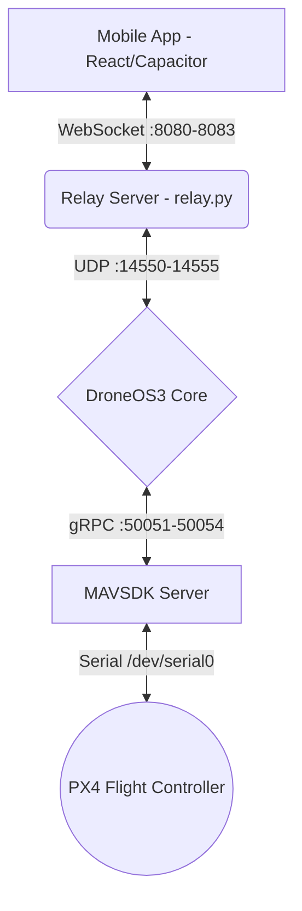

# DroneSwarm (PhoneOS Swarm) 🚁

DroneSwarm is a scalable, multi-agent drone operating system and ground control station (GCS). It bridges the gap between hardware flight controllers (PX4 via MAVSDK) and a rich, responsive mobile application for fleet management.

## 🌟 Key Features

* **Swarm Intelligence:** Manage up to 4 drones simultaneously. The `DroneOS3` core dynamically handles peer-to-peer heartbeat tracking, telemetry syncing, and failsafes.
* **Multi-Drone Dashboard:** A beautiful, responsive React-based ground control station (in `mobile/`) that connects to multiple drones via WebSocket. View live synchronized telemetry and artificial horizons for the entire swarm simultaneously in a responsive grid layout.
* **Hardware-Agnostic Core:** Powered by a clean Adapter pattern. It uses `px4_adapter.py` to talk to MAVSDK and real Pixhawk hardware, but gracefully falls back to SITL (Simulation in the Loop) or test modes when hardware isn't present.
* **Terminal Command Parsing:** Built-in NLP-like terminal controller allows users to parse and execute human-readable drone commands (e.g., "takeoff to 5m, hover for 2 seconds, and land").
* **Custom UDP/WebSocket Relay:** Ships with a high-performance Python relay (`relay.py`) that bridges UDP MAVLink/JSON telemetry from the drones directly to your browser/mobile app over WebSocket.

## 🏗️ Architecture



## 🚀 Getting Started

### 1. Hardware Setup (Raspberry Pi)
The system is designed to run on a Raspberry Pi connected directly to a Pixhawk flight controller via serial telemetry.

```bash
# Clone the repository
git clone https://github.com/Debanshu2005/DroneSwarm.git
cd DroneSwarm

# Run the setup script to install dependencies and systemd services
./deploy/install.sh 1
```

### 2. Running a Drone Node
Each drone in the swarm uses its own startup script to configure its specific `drone_id`, serial port index, network ports, and initialize the lifecycle manager (which boots MAVSDK, the Relay, and DroneOS3).

```bash
# Example for Drone 1
python start_drone1.py
```

### 3. Running the Mobile App (GCS)
The Ground Control Station is a modern Node.js/React application built with Vite.

```bash
cd mobile
npm install
npm run dev
```
Once the app is running, go to **Settings > Multi-Drone Connections** and add your drones' IP addresses on their respective WebSocket ports (e.g., 8080, 8081, 8082, 8083).

### 4. Building the Android APK
The mobile app uses Capacitor for native packaging. To build the APK for Android:

```bash
cd mobile
npm run build
npx cap sync android
cd android
./gradlew assembleDebug
```
The resulting APK will be generated at `mobile/android/app/build/outputs/apk/debug/app-debug.apk`.

## 📂 Project Structure

* `/DroneOS3`: The core Python operating system running on the companion computer (Raspberry Pi).
* `/mobile`: The React/Capacitor mobile application (PhoneOS GCS).
* `/relay`: The UDP-to-WebSocket bridge allowing the web app to talk to the drone network.
* `/start_drone*.py`: Lifecycle managers that boot all required services for a specific drone node.
* `/deploy`: Systemd services and deployment scripts.

## 🛡️ Failsafes and Safety
DroneOS3 includes an aggressive `SafetyModule` and `HealthMonitor`. It actively monitors:
- Network Connection loss (triggers RTL/Land based on altitude)
- Battery limits (Critical and Low battery failovers)
- Hardware diagnostics (GPS loss, Gyro failures)

## 📄 License
This project is licensed under the MIT License - see the [LICENSE](LICENSE) file for details.
