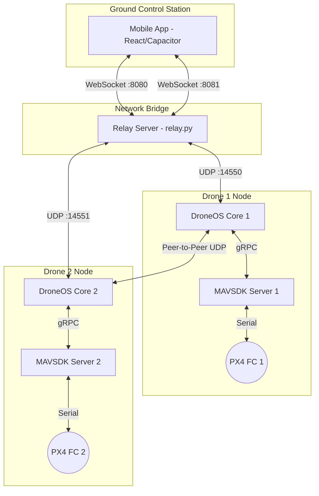
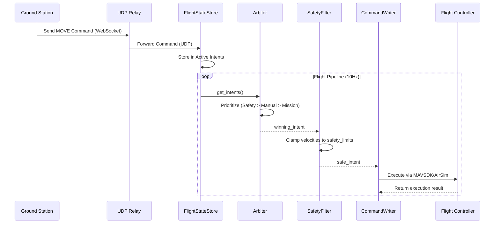
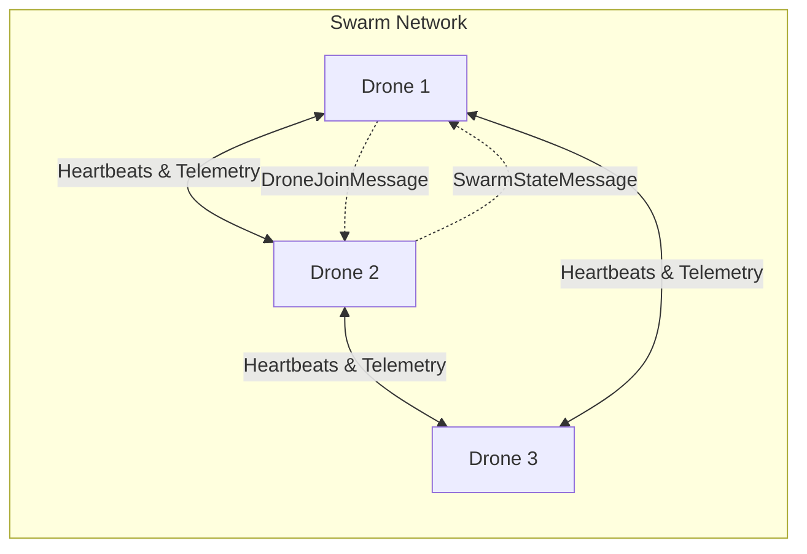

<h1 align="center">PhoneOS Swarm</h1>

<p align="center">
  🚁 Scalable, multi-agent drone operating system and rich, responsive mobile ground control station.
</p>

<p align="center">
  <a href="https://github.com/Debanshu2005/DroneSwarm/stargazers"></a>
  <a href="https://github.com/Debanshu2005/DroneSwarm/commits/main"></a>
  <a href="https://github.com/Debanshu2005/DroneSwarm/blob/main/LICENSE"></a>
  <a href="https://github.com/Debanshu2005/DroneSwarm/pulse"></a>
  <a href="https://github.com/Debanshu2005"></a>
</p>

<p align="center">
  
</p>

## Mobile App Simulation
https://github.com/user-attachments/assets/426d9305-4a38-4753-a019-aa2a98f3f77d

## AirSim Simulation
https://github.com/user-attachments/assets/f3a2a1c6-26ea-4c27-bca7-7f7c4041c44d

## 1. Project Overview
PhoneOS Swarm (DroneSwarm) is an advanced, distributed autonomous drone operating and control software platform built for real-world, multi-agent drone operations. It is designed to bridge the gap between high-level swarm intelligence and low-level physical flight execution. By actively decoupling intelligent swarm behaviors from the physical flight controller, PhoneOS Swarm introduces a hardware-agnostic architecture. It leverages native hardware capabilities (Pixhawk/MAVSDK) and simulation environments (AirSim) for flight stability, while running an asynchronous, high-performance node layer on companion computers (like Raspberry Pi) and a rich mobile Ground Control Station (GCS).

## 2. Core Architecture
PhoneOS Swarm utilizes a clear separation of concerns, routing human or autonomous commands through a fast UDP-to-WebSocket relay, into a safety-checked OS environment (DroneOS), and finally to the flight controller.


```mermaid
graph TD
    subgraph Ground Control Station
        GCS[Mobile App - React/Capacitor]
    end

    subgraph Network Bridge
        Relay[Relay Server - relay.py]
    end

    subgraph Drone 1 Node
        OS1[DroneOS Core 1]
        MAV1[MAVSDK Server 1]
        FC1((PX4 FC 1))
    end
    
    subgraph Drone 2 Node
        OS2[DroneOS Core 2]
        MAV2[MAVSDK Server 2]
        FC2((PX4 FC 2))
    end

    GCS <-->|WebSocket :8080| Relay
    GCS <-->|WebSocket :8081| Relay
    
    Relay <-->|UDP :14550| OS1
    Relay <-->|UDP :14551| OS2
    
    OS1 <-->|Peer-to-Peer UDP| OS2

    OS1 <-->|gRPC| MAV1
    MAV1 <-->|Serial| FC1
    
    OS2 <-->|gRPC| MAV2
    MAV2 <-->|Serial| FC2
```

## 3. Repository Structure
```text
PhoneOS_Swarm/
├── README.md               # Project documentation
├── DroneOS1/               # DroneOS instance for Drone 1
├── DroneOS2/               # DroneOS instance for Drone 2
├── DroneOS3/               # DroneOS instance for Drone 3
├── DroneOS/                # Base DroneOS core components
│   ├── adapters/           # Hardware abstraction layer (PX4, AirSim)
│   ├── configs/            # YAML configuration files
│   ├── core/               # Core flight, safety, mission, and swarm logic
│   ├── shared/             # Shared protocols, networking, and message definitions
│   └── tests/              # Unit and integration tests for DroneOS
├── deploy/                 # Systemd services and deployment scripts
├── mobile/                 # React/Capacitor mobile application (PhoneOS GCS)
├── relay/                  # UDP-to-WebSocket bridge for GCS communication
├── scripts/                # Helper scripts (e.g., AirSim smoke tests)
└── start_drone*.py         # Lifecycle managers for specific drone nodes
```

## 4. System Components

### DroneOS
DroneOS runs on the companion computer and acts as the brain of the drone.
* **Flight Controller Adapter:** Translates high-level actions into hardware-specific API calls (`px4_adapter.py` for MAVSDK, `airsim_adapter.py` for Unreal Engine simulation).
* **Command Handler / Flight Pipeline:** Receives and routes incoming network commands to appropriate subsystems, prioritizing intents based on source.
* **Flight Manager:** Manages basic flight behaviors (Arm, Disarm, Takeoff, Land, RTL, Move).
* **Safety System:** Enforces connection timeouts, battery critical levels, and applies horizontal/vertical safety velocity limits.
* **Mission Manager:** Handles the storage, progression, and execution of complex multi-waypoint missions.
* **Swarm Management:** Manages peer discovery and heartbeats for multi-drone operations (supporting up to 4 drones natively).
* **Decision Engine:** Periodically evaluates telemetry and swarm state to make autonomous movement decisions.

### Mobile App (Ground Control Station)
The PhoneOS GCS is a responsive React-based ground control station.
* Connects to multiple drones via WebSocket through `relay.py`.
* Provides a multi-drone dashboard with live synchronized telemetry.
* Displays artificial horizons for the entire swarm simultaneously in a responsive grid layout.

## 5. Flight Controller Integration
PhoneOS Swarm uses the Adapter Pattern to interface with flight controllers.
* **PX4 Adapter:** Utilizes MAVSDK to connect to Pixhawk hardware via serial/USB. Subscribes asynchronously to telemetry streams and translates flight commands.
* **AirSim Adapter:** Enables full 3D Unreal Engine simulation testing using AirSim, seamlessly falling back to SITL when real hardware isn't present.
* **Safety Authority:** SwarmOS respects the native flight-controller safety authority. It does not bypass Pixhawk's native safety mechanisms.

## 6. Command Pipeline
Commands flow through a strict, serialized pipeline (`flight_pipeline.py`) ensuring that only valid, safe actions reach the hardware.


```mermaid
sequenceDiagram
    participant Operator as Ground Station
    participant Relay as UDP Relay
    participant State as FlightStateStore
    participant Arbiter as Arbiter
    participant Safety as SafetyFilter
    participant Writer as CommandWriter
    participant FC as Flight Controller

    Operator->>Relay: Send MOVE Command (WebSocket)
    Relay->>State: Forward Command (UDP)
    State->>State: Store in Active Intents
    loop Flight Pipeline (10Hz)
        State->>Arbiter: get_intents()
        Arbiter->>Arbiter: Prioritize (Safety > Manual > Mission)
        Arbiter-->>Safety: winning_intent
        Safety->>Safety: Clamp velocities to safety_limits
        Safety-->>Writer: safe_intent
        Writer->>FC: Execute via MAVSDK/AirSim
        FC-->>Writer: Return execution result
    end
```

* **Supported Actions:** ARM, DISARM, TAKEOFF, LAND, RTL, HOVER, MOVE_VELOCITY, GOTO.
* **Terminal Controller:** A built-in NLP-like terminal controller allows parsing of human-readable commands.

### NLP Terminal Commands Reference

The NLP terminal accepts natural English language or compact forms. **Note:** when taking off or maneuvering near the ground, specify an altitude to avoid safety guard rejections. When assembling a swarm formation, the minimum allowed spacing is `12m` due to collision avoidance safety guards.

**Natural English Examples:**
* `take off to 3 meters, hover for two seconds, and land`
* `fly in a 10 meter radius circle at 5 meter altitude`
* `do a 10 meter square search pattern at 3 meters`
* `fly a triangle with 6 meter sides at 3 meters`
* `fly a figure eight size 5 at 3 meters`
* `go 10 meters north and 5 meters east at 3 meters altitude`
* `move 5 meters forward and 2 meters up`
* `go 5 meters high`
* `hold position`
* `switch mode to guided`
* `land now`
* `return to launch`

**Swarm Formation Commands:**
* `formation V spacing 15m`
* `formation circle spacing 12m`
* `formation line spacing 15m`
* `form diamond spacing 20m`

*(Note: Supported formation shapes include `v`, `circle`, `square`, `line`, `column`, `wedge`, `echelon_left`, `echelon_right`, `diamond`, and `grid`)*

**Compact Command Forms:**
* `takeoff h=3 hover_s=2`
* `circle r=10 h=5 n=36`
* `square size=10 h=3 passes=4`
* `triangle size=6 h=3`
* `grid size=10 h=3 passes=4`
* `spiral size=10 h=3 turns=3`
* `figure-8 size=5 h=3`
* `goto x=10 y=5 h=3`
* `climb 2 | descend 1 | lower 50cm`
* `mode guided | mode alt_hold`
* `hold | land | rtl`

## 7. Safety Architecture
Safety is handled in complementary layers:
* **Connection Heartbeats:** Loss of heartbeat triggers an automatic RTL or Land depending on altitude.
* **Battery Failsafes:** Critical and Low battery failovers built into the HealthMonitor.
* **Velocity Clamping:** Software safety filters cap horizontal and vertical velocities before they reach the flight controller.

## 8. ARM / TAKEOFF Safety Workflow
A strict distinction is maintained between Arming and Taking off:
* **ARM:** Evaluates native pre-arm checks. Physical arm confirmation must be received via telemetry before flight.
* **TAKEOFF:** Implicitly requires the drone to be armed first. Sets takeoff altitude and issues command to FC.

## 9. Telemetry Pipeline
Telemetry is continuously streamed from the flight controller to the network via a high-performance UDP/WebSocket Relay.
* **Pipeline:** Flight Controller -> Adapter -> DroneOS Core -> UDP Broadcast -> Relay -> WebSocket -> Mobile GCS.
* **Fields Supported:** Latitude, Longitude, Altitude, Velocity, Battery Level, Flight Mode, Armed State, etc.

## 10. Mission System
Supports distributed mission workflows:
* **Upload & Management:** JSON-based mission plans are transmitted to the drone and stored locally. Operators can start, stop, pause, and resume execution dynamically.

## 11. Swarm System
Built for multi-drone coordination (up to 4 drones natively):


```mermaid
graph LR
    subgraph Swarm Network
        D1[Drone 1]
        D2[Drone 2]
        D3[Drone 3]
    end

    D1 <-->|Heartbeats & Telemetry| D2
    D2 <-->|Heartbeats & Telemetry| D3
    D3 <-->|Heartbeats & Telemetry| D1
    
    D1 -.->|DroneJoinMessage| D2
    D2 -.->|SwarmStateMessage| D1
```

* **Peer-to-Peer Tracking:** Drones exchange heartbeats, telemetry, and future intents to maintain situational awareness.
* **Collision Avoidance:** Subsystems in the decision engine prevent physical overlaps during dynamic routing.

## 12. Ground Station (Mobile App)
The modern Node.js/React application provides a comprehensive UI:
* **Multi-Drone Dashboard:** Live readouts of altitude, speed, battery, and attitude for up to 4 drones.
* **WebSockets Integration:** High-frequency, low-latency updates via the custom Python relay.

## 13. Communication Architecture
* **Drone-to-Drone:** Fast, lightweight asynchronous UDP stack (ports 14550-14555).
* **Drone-to-GCS:** UDP-to-WebSocket bridge (ports 8080-8083).
* **Serialization:** JSON-based serialization via Pydantic schemas.

## 14. Error Handling
* **Command Validation:** Incoming network messages are strictly validated.
* **Hardware Rejections:** Exceptions from MAVSDK are caught, logged, and prevented from crashing the system.

## 15. Configuration
Configuration is managed via structured YAML files:
* Ensure `adapter_type` (e.g., `"airsim"` or `"px4"`) is correctly set in `configs/flight.yaml` files based on your environment.

## 16. Installation
For a Raspberry Pi (or Linux) setup:

```bash
# Clone the repository
git clone https://github.com/Debanshu2005/DroneSwarm.git
cd DroneSwarm

# Run the setup script to install dependencies and systemd services
./deploy/install.sh 1
```

## 17. Running the System

### Running a Drone Node
Each drone in the swarm uses its own startup script to boot MAVSDK, the Relay, and DroneOS core.
```bash
# Example for Drone 1
python start_drone1.py
```

### Running the Mobile App (GCS)
```bash
cd mobile
npm install
npm run dev
```
Once running, go to **Settings > Multi-Drone Connections** and add your drones' IP addresses on their respective WebSocket ports (e.g., 8080, 8081, 8082, 8083).

### Building the Android APK
```bash
cd mobile
npm run build
npx cap sync android
cd android
./gradlew assembleDebug
```
The resulting APK will be at `mobile/android/app/build/outputs/apk/debug/app-debug.apk`.

### Running in Simulation (AirSim)
1. Download and run an AirSim environment.
2. Copy the settings: `cp scripts/airsim_settings_example.json ~/Documents/AirSim/settings.json` (on Windows).
3. Set `adapter_type: "airsim"` in `configs/flight.yaml`.
4. Run the smoke test:
```bash
python scripts/airsim_smoke_test.py --pkg DroneOS --vehicle Drone1
```

## 18. Hardware Setup
* **Companion Computer:** Raspberry Pi or similar Linux SBC.
* **Flight Controller:** Pixhawk running PX4 firmware.
* **Connection:** Serial telemetry link between Pi and Pixhawk.

## 19. ⚠️ SAFETY WARNING
* Remove propellers during all software, networking, and hardware integration testing.
* Never test autonomous flight in unsafe areas. Obey all local aviation regulations.
* Never attempt to bypass flight-controller safety checks. DroneOS is an intelligence layer, not a replacement for a certified flight controller.

## 20. Testing
Swarm logic and adapter unit tests can be found in the `/tests/` directories.
* Real-flight swarm behavior requires physical validation and tuning.

## 21. Current Status
| Component | Status |
|---|---|
| DroneOS Architecture | Implemented |
| PX4/MAVSDK Integration | Implemented |
| AirSim Integration | Implemented |
| Telemetry & Command Pipeline | Implemented |
| React Mobile GCS | Implemented |
| Swarm Communication | Implemented |
| Hardware Validation | Requires Physical Testing |

## 22. Known Limitations
* Real-flight swarm behavior requires physical validation and tuning.
* GPS data is unavailable indoors; AirSim is recommended for indoor simulated swarm testing.

## 23. Development Principles
* **Separation of Concerns:** Mobile UI, Networking relay, OS logic, and Hardware adapters are isolated.
* **Adapter Pattern:** The `IFlightController` interface ensures DroneOS can swap out PX4 for AirSim seamlessly.

## 24. Future Roadmap
* **Planned:** Integration of advanced visual odometry or RTK GPS for precision swarm formations.
* **Planned:** Decentralized leaderless consensus algorithms for swarm obstacle avoidance.
* **Planned:** Enhanced iOS build support for the Capacitor mobile app.

## 25. Contributing
1. Fork the repository
2. Create your feature branch (`git checkout -b feature/AmazingFeature`)
3. Commit your changes (`git commit -m 'Add some AmazingFeature'`)
4. Push to the branch (`git push origin feature/AmazingFeature`)
5. Open a Pull Request

## 26. License
This project is licensed under the MIT License - see the [LICENSE](LICENSE) file for details.

## 27. Author / Repository
Repository: [https://github.com/Debanshu2005/DroneSwarm](https://github.com/Debanshu2005/DroneSwarm)
