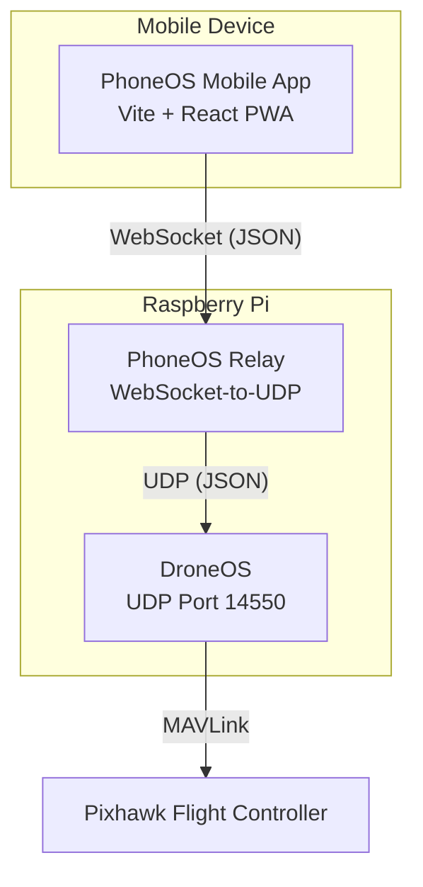

# PhoneOS Architecture

PhoneOS is a mobile phone GroundStation designed to control and monitor the SwarmOS DroneOS project. It brings the capabilities of the laptop GroundStation to a mobile-friendly frontend, without modifying the core functionality of the SwarmOS system.

## 1. High-Level Architecture

The architecture maintains the strict requirement that DroneOS itself is **not modified** and still uses its original UDP communication scheme.

### Components
1. **PhoneOS Mobile App**: A web application running locally on the phone's browser (or packaged as a PWA/native app). It connects to the relay over Wi-Fi.
2. **PhoneOS Relay**: A transparent transport layer running on the Raspberry Pi alongside DroneOS. It maps incoming WebSocket strings directly to UDP packets and vice-versa, preserving the exact JSON protocol schemas (`HeartbeatMessage`, `ControlMessage`, etc.).
3. **DroneOS**: The existing Python application unchanged.

## 2. Communication & Protocol

The system utilizes the same UDP port (14550) logic that SwarmOS expects:
- DroneOS binds to `0.0.0.0:14550`
- PhoneOS Relay binds its UDP listener to `0.0.0.0:14551` to avoid `SO_REUSEADDR` unicast collisions with DroneOS.
- When the Relay sends a broadcast, it sends to `255.255.255.255:14550`.
- When DroneOS replies (e.g. telemetry), it learns the Relay's UDP port (`14551`) dynamically and replies via Unicast.
- The Relay then pushes that JSON back over the WebSocket to the PhoneOS Mobile App.

This bidirectional dynamic learning allows the Phone to behave exactly like the laptop GroundStation.

## 3. Laptop + Phone Coexistence

Because the PhoneOS relies on the Relay, and the Relay acts as just another standard UDP node broadcasting over the network (from port 14551), the existing Laptop GroundStation (which binds to 14550 and sends to 14550) will continue to function flawlessly in parallel.

DroneOS manages multiple network endpoints via its dynamic unicast peer learning inside `UdpNetworkAdapter` (`self.known_endpoints`). Both the Laptop GS and PhoneOS GS will receive telemetry, and both can issue commands.

## 4. Multi-Drone Support

Like the SwarmOS GroundStation, PhoneOS tracks multiple drones. When a user selects a specific drone from the UI, PhoneOS sets the `target_id` property in the JSON message. The Relay observes this `target_id` and uses Unicast to route the packet directly to the specific drone, avoiding broadcast storms.

## 5. Safety Behavior

- **Explicit Action**: Critical actions (ARM, TAKEOFF) prompt the user for confirmation.
- **Double Tap**: EMERGENCY STOP requires a double tap to prevent accidental deployment.
- **True Status**: The UI never assumes success. The "ARMED" state is purely derived from `TelemetryData.armed_state`.
- **Heartbeat Monitoring**: If the drone's heartbeat is lost for more than 5 seconds, the UI clearly displays a "LOST" status and disables flight control inputs.
